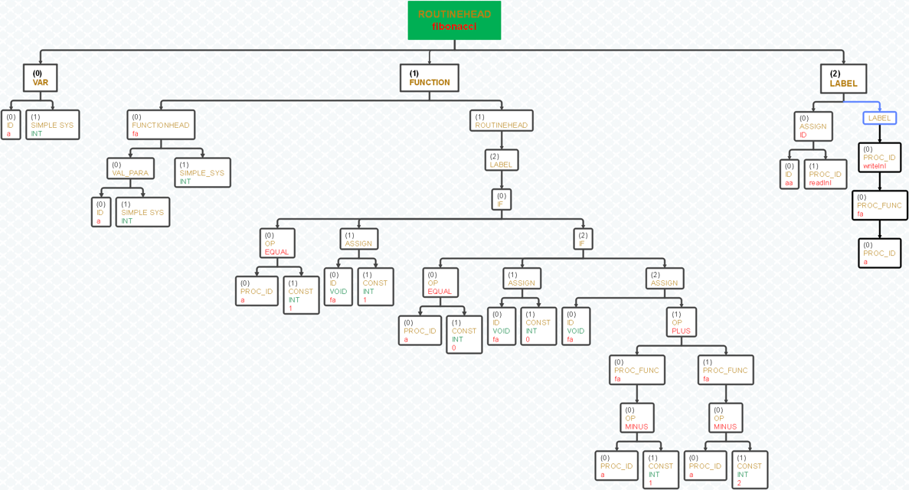

# miniPascal Compiler
*A pascal compiler which can translate pascal code to Jasmin assembly language*  
**-->本專案以C/C++高級語言撰寫，將miniPascal語言作為編譯目標，最終生成能運行於JVM上的Java字節碼（Java bytecode)**  
**-->由於直接翻譯成Java字節碼，因此省略了中間代碼生成的過程**

# OverView
*要完成一個編譯器,通常需要幾個階段：
1. (O)詞法分析 (Lexical Analysis)
2. (O)語法分析 (Syntax Analysis)
3. (O)語義分析 (Semantic Analysis)
4. (X)中間代碼生成 (Intermediate Code Generation)
5. (X)中間代碼優化 (Intermediate Code Optimization)
6. (O)目標代碼生成 (Target Code Generation)

## 1.詞法分析 (Lexical Analysis)
*目標：將源代碼轉換為一系列標記（tokens)。*  
*過程：讀取源代碼字符流，識別並生成標記，如關鍵字、標識符、操作符、字面值等。*    
*工具：可以使用工具如 Lex 或 Flex 來生成詞法分析器。*    
*Example：*    
```
//識別變數名稱
[a-zA-Z][a-zA-Z0-9]*  {
                          LIST;
                          yylval.loc.text = (char*)malloc(strlen(yytext)+1);
                          strcpy(yylval.loc.text,yytext);				             
                          yylval.loc.first_line = line_no;                  //紀錄行數
                          yylval.loc.first_column = col_no - yyleng;        //記錄列數
                          return(IDENTIFIER);                               //識別token為變數名稱
                      }
```

## 2.語法分析 (Syntax Analysis)
*目標：檢查標記的結構是否符合語法規則，生成語法樹。*  
*過程：基於詞法分析器生成的標記流，使用文法規則構建抽象語法樹（AST）。*  
*工具：可使用工具如 Yacc 或 Bison 來生成語法分析器。*  
*備註：參考資料有yacc與lex使用教學*

## 3.語義分析 (Semantic Analysis)
*目標：檢查語法樹的語義正確性。*  
*過程：進行類型檢查、變量範圍檢查等，確保程序的邏輯一致性。*  
*工具：使用C/C++實現*  
*心得：此為筆者認為編譯器設計較複雜過程，並以下面三個階段[建立AsT Tree] [建立Symbol Table] [實現語意分析邏輯]做解析*    
### 3.1.建立AST Tree
*Abstract Syntax Tree(抽象語法樹)，是編譯器和解釋器中使用的一種樹狀資料結構。*  
*在語法分析的過程中，利用tree結構紀錄每個走過的語法(參考parser.y)*  
```
//使用%type 指示符用於定義各種非終結符（non-terminal symbols）的類型
%type <node> prog routine routine_head routine_part function_decl function_head parameters para_decl_list para_type_list

//配合語法分析，為樹狀結構增添屬性
prog: PROGRAM IDENTIFIER LPAREN identifier_list_p RPAREN SEMICOLON  
      routine
      DOT
      {        
      	$$ = $7;  
      	$$->setAttribute($2.text); 
      	savedTree = $$;
      }
      ;
```
*以實際Pascal代碼為例：*  
```
program fibonacci_recursive(output);
VAR a:integer;
FUNCTION fa (a:integer) :integer;
begin
     if a = 1 then
        fa := 1
     else  if a = 0 then
        fa := 0
     else   fa:=fa(a-1)+fa(a-2)
end;
begin
    a:=readlnI;
    writelnI(fa(a))
end.
```
*經整理得出的AST tree如下：*    

*其中:*    
* ROUNTINEHEAD 為 程式主體屬性  
* VAR          為 變數的宣告  
* FUNCTION     為 函數的宣告  
* LABEL        為 動作的行為，例如 賦值、IF statement、while statement等  
*-->屬性定義因人而異，可依自己喜好定義，本案其他相關屬性可參考typemap.h*  


### 3.2.建立Symbol Table
### 3.3.實現語意分析邏輯

## 4.目標代碼生成 (Target Code Generation)
*目標：將抽象語法樹轉換為目標平台的代碼。*  
*過程：生成Jasmin Code，以便進行後續的優化和執行。*  
*工具：使用定義代碼生成來完成此任務。*  

## Runtime Environment
* Ubuntu 20.04.4
* G++ 9.4
* Flex 2.6.4
* Bison 3.5.1

## Summary and flow chart


## How to use this project?
* 將要執行的Pascal源碼與Jasmin.jar 與 io.class放入assembly資料夾 *  
* 根據Demo影片步驟即可編譯與執行代碼 *  
[Demo](https://youtu.be/hmFLkoay438)

## 參考資料
- [Lex&Yacc 使用教學](https://zhuanlan.zhihu.com/p/143867739)
